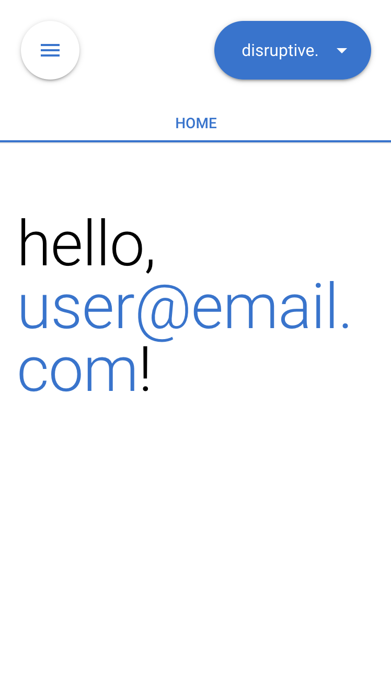
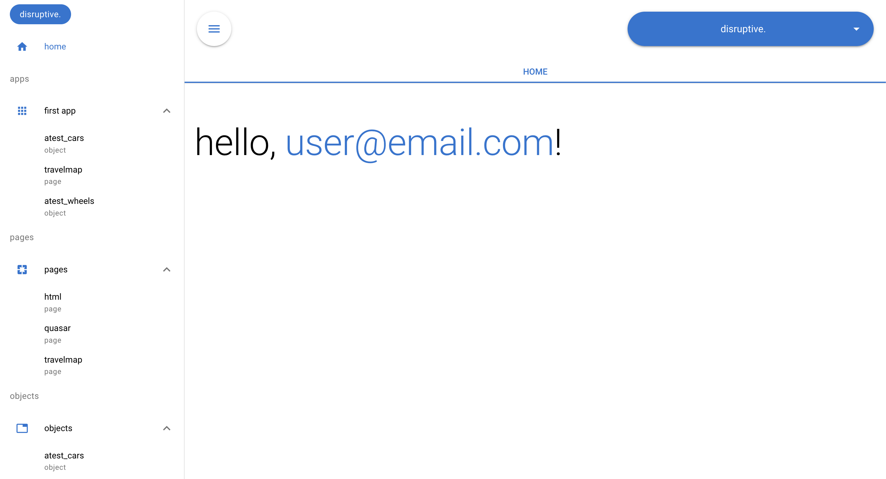

# abentari. - open source portal and cms

abentari. is an easy way to bring your processes into a database.
Just create any kind of objects and fields you want and give users access to these.
It is fully open source and uses Postgres/Supabase as a backend so that you are able to easily access your data from anywhere.
See the feature list below to get a better feeling what abentari. is capable of.

<br/>
<table style="width: 100%">
  <tr>
    <th>
      <b>Mobile</b>
    </th>
    <th style="width: 100%">
      <b>Desktop</b>
    </th>
  </tr>
  <tr>
    <td>
      
    </td>
    <td>
      
    </td>
  </tr>
</table>
<br/>

## Features

- general
  - Everything is open source and self hostable
  - Highly customizable (create your own ERP, CRM, ...)
  - Build on top of Postgres/Supabase
  - Data can be easily accessed from anywhere
- objects
  - Create unlimited of objects/tables (for example companies, contacts, customers, orders, ...)
  - Track any kind of changes to the data of these objects
- fields
  - Create any number of fields within the objects to collect all information you need (text, picklist, relations, files, ...)
  - Fields can then be added to the layout of the parent object
- profiles
  - Permission management to grant access to specific objects, apps, pages, actions, ...
  - Guest users also have a profile so you can share data publicly ("unauthenticated")
  - Create public profiles that enable any users to sign up
  - Require MFA for users of a specific profile
- users
  - Manage any users in your instance
  - Create internal users that are able to sign up only with a secret
- pages
  - Create your own pages for even more flexibility
- apps
  - Create apps to group objects and pages together
- cpermissions
  - Create your own custom permissions
- actions
  - Create custom actions with your own logic
- csql
  - Create any custom SQL logic needed for your processes (for example triggers for validation rules)
- settings
  - Adjust settings of your instance
  - Create your own custom settings
- run
  - Execute SQL commands to for example query data
- retrieve
  - Retrieve metadata from your instance
  - Also accessible via CLI
- deploy
  - Deploy metadata to your instance
  - Also accessible via CLI
- history
  - All metadata and data changes are being tracked by default
- security
  - Easy permission management
  - Multi-factor authentication

<br/>

## Installation

### 1. Initialise Supabase

1. Create Supabase projects (Cloud or self-hosted)

2. Deactivate "Confirm email" setting if users should not be requested to confirm email after registration (otherwise setup SMTP)

Authentication > Sign In / Provider > Email > Auth Providers > Disable "Confirm email"

3. Setup the Site URL (adjust https://yourdomain.com accordingly)

Authentication > URL Configuration > Site URL > https://yourdomain.com

4. Setup the Redirect URL (adjust https://yourdomain.com/* accordingly)

Authentication > URL Configuration > Redirect URLs > https://yourdomain.com/*

5. Run all migrations scripts in supabase/migrations folder (script in supabase > utils > migration_commands.txt can be used to create an sql file with all migrations (supabase > utils > everything > everything.sql))

6. Create admin user (adjust email:{{admincontactemail}} and signupsecret:{{gen_random_uuid()}} before running this)

Recommended with MFA:

```sql
SET LOCAL session_replication_role = replica;
INSERT INTO public.xusers (id, profile_id, invite_email, invite_secret, invite_open, is_active, is_public, is_unauthenticated, skip_puser, is_superuser, created_by)
VALUES ('4ba98607-d109-449c-9773-250c592e4069'::uuid, (SELECT id FROM public.profiles WHERE api_name = 'admin'), '{{admincontactemail}}', '{{gen_random_uuid()}}' , true, true, false, false, true, true, '11111111-1111-1111-1111-111111111111');
INSERT INTO public.c_pusers__abfe9125_deb6_4d0f_8bc5_9d2d0700f413 (name, email, user_id, xuser_id, owner_id, created_by)
VALUES ('ADMIN', '{{admincontactemail}}', null, '4ba98607-d109-449c-9773-250c592e4069', '4ba98607-d109-449c-9773-250c592e4069', '11111111-1111-1111-1111-111111111111');
SET LOCAL session_replication_role = DEFAULT;
```

Less secure without MFA (not recommended for production):

```sql
SET LOCAL session_replication_role = replica;
UPDATE public.profiles SET mfa_enabled = false WHERE api_name = 'admin';
INSERT INTO public.xusers (id, profile_id, invite_email, invite_secret, invite_open, is_active, is_public, is_unauthenticated, skip_puser, is_superuser, created_by)
VALUES ('4ba98607-d109-449c-9773-250c592e4069'::uuid, (SELECT id FROM public.profiles WHERE api_name = 'admin'), '{{admincontactemail}}', '{{gen_random_uuid()}}' , true, true, false, false, true, true, '11111111-1111-1111-1111-111111111111');
INSERT INTO public.c_pusers__abfe9125_deb6_4d0f_8bc5_9d2d0700f413 (name, email, user_id, xuser_id, owner_id, created_by)
VALUES ('ADMIN', '{{admincontactemail}}', null, '4ba98607-d109-449c-9773-250c592e4069', '4ba98607-d109-449c-9773-250c592e4069', '11111111-1111-1111-1111-111111111111');
SET LOCAL session_replication_role = DEFAULT;
```

7. OPTIONAL: For QA or dev environments you should also run the specific seed file (supabase > seedslocal)

8. OPTIONAL: If you want to enable to delete files (filedeletion.js) for setup users also run this SQL script

```sql
drop policy if exists "storagedelete" on storage.objects;
create policy "storagedelete"
on storage.objects
for delete
to authenticated
using (
  bucket_id = 'storage1'
  and (storage.foldername(name))[1] = 'objects'
  and policyfunction_checkallpermission((select auth.uid()), ((select auth.jwt()) ->> 'email'), 'setup')
  or (policyfunction_checkallpermission((select auth.uid()), ((select auth.jwt()) ->> 'email'), 'setuplimited') and policyfunction_checkallpermission((select auth.uid()), ((select auth.jwt()) ->> 'email'), 'file.delete'))
);
```

### 2. Install Quasar and build the app for production

This step can be skipped when your deployment platform in step 3 is able to build the app for you. In both cases adjust the environment variables.

```bash
npm i -g @quasar/cli
```

```bash
npm install
```

```bash
PSUPABASE='yes' PSUPABASEENVIRONMENT='{{environmentname (for example dev, qa, pre, hotfix, main)}}' PSUPABASELINK='{{supabaselink}}' PSUPABASEKEY='{{supabasekey}}' quasar build -m pwa
```

OR

```bash
PSUPABASE='yes' PSUPABASEENVIRONMENT='{{environmentname (for example dev, qa, pre, hotfix, main)}}' PSUPABASELINK='{{supabaselink}}' PSUPABASEKEY='{{supabasekey}}' npx quasar build -m pwa
```

### 3. Deploy the app for production

Deploy it on a deployment platform like Cloudflare or Vercel.

### 4. Sign up with admin account

Lastly navigate to the deployed app https://yourdomain.com/#/main/login/ and sign up with the set email and secret from above and a random password. Enjoy!

<br/>

## Upgrading

1. Run all missing migration files (supabase > migrations)

2. Deploy new version of the app

<br/>

## Advanced

### Development

#### Install Quasar

https://quasar.dev/start/quasar-cli/

#### Install Supabase locally and run it

https://supabase.com/docs/guides/local-development

#### Install Playwright for testing

https://playwright.dev/docs/intro

#### Run specific seed file

There are different seed files (supabase > seedslocal) which are needed for running for example the Playwright tests successfully.

#### Start the app in development mode (hot-code reloading, error reporting, etc.)

```bash
PSUPABASE='yes' PSUPABASEENVIRONMENT='{{environmentname  (for example dev, qa, pre, hotfix, main)}}' PSUPABASELINK='{{supabaselink}}' PSUPABASEKEY='{{supabasekey}}' quasar dev -m pwa
```

OR

```bash
PSUPABASE='yes' PSUPABASEENVIRONMENT='{{environmentname  (for example dev, qa, pre, hotfix, main)}}' PSUPABASELINK='{{supabaselink}}' PSUPABASEKEY='{{supabasekey}}' npx quasar dev -m pwa
```

#### Run Playwright tests

```bash
PURL="http://localhost:9200" PADMINEMAIL="pw_admin@abentari.invalid" PADMINPASSWORD="{{PADMINPASSWORD}}" PUSEREMAIL="pw_user@abentari.invalid" PUSERPASSWORD="{{PUSERPASSWORD}}" npx playwright test --project='firefox'
```
